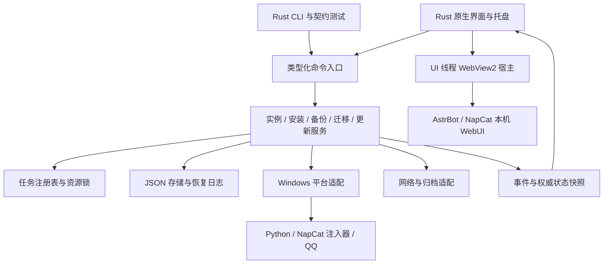

# AstriaX 功能分析与 Rust 完整重构规划

日期：2026-10-10。分析基线：Git `341683d`，`package.json` 版本 `1.0.1`。

状态：已开始实施 Tauri + 现有 Vue 方案。本文的源码统计、风险分析与接口快照保留为 Electron 基线；已实现模块、测试证据和待验收项见 [实施记录](./implementation.md)。未将全部规划验收项标为完成。

配套文件：

- [实施记录与构建说明](./implementation.md)：实际运行入口、模块边界、兼容性、验证结果及剩余验收。
- [功能覆盖与验收矩阵](./feature-matrix.md)：每个功能域的现有实现、Rust 归属、验收与阶段。
- [接口与源码统计快照](./inventory.json)：请求通道、事件、源文件位置、测试数量及目标模块映射。

## 1. 重构目标与范围

最终采用用户指定的 **Tauri + 现有 Vue**：启动器与控制台业务由 Rust 实现，Vue 保留页面和交互状态，系统 WebView2 承载界面与第三方 WebUI。发布的启动器不包含 Electron 或 Node.js；Node.js/pnpm 只用于构建前端。此选择替代初始规划中的全 Rust 原生界面建议。

“完整”以仓库自有的启动器功能为范围，包含环境安装、下载源、运行时、实例、进程、凭据、日志、备份、迁移、更新、桌面交互与发布维护工具。第一发布目标继续为 Windows 10/11 x64，保持现有中文交互与品牌资源。

必须区分以下三个层次：

| 层次 | 本规划的最终状态 |
|---|---|
| AstriaX 自有业务和界面 | Rust 核心 + Tauri 宿主；保留 Vue/TS 视图与交互，不在前端执行进程、安装、文件管理业务 |
| AstrBot、NapCat、QQ 及其 Dashboard/WebUI | 外部受管理组件，继续使用上游实现；AstrBot 仍需要 Python，NapCat/QQ 仍包含 JavaScript 与原生组件 |
| 系统组件、构建工具、适配资源 | 使用 Win32/WebView2/MSVC/NSIS；上游接入所需的 `sitecustomize.py`、`loadNapCat.js` 等小型脚本作为版本化适配资源，由 Rust 管理 |

因此可以实现“启动器后端全部由 Rust 实现”，不能据此宣称“整个 AstrBot/NapCat/QQ 运行栈没有 Python/JavaScript/C++”。若目标还包括把上游服务、插件生态、协议端与浏览器引擎也改写为 Rust，需另立大型项目，不能用本仓库的重构工作量代替。若连适配脚本都不允许存在，也必须单独研究上游加载协议；单纯替换启动器语言无法达成。

## 2. 当前项目构成

### 2.1 实际执行路径

```text
package.json: main = out/main/index.js
  electron-vite → src/main/index.ts
    窗口 / 单实例 / UAC / 启动诊断 / 托盘 / 退出编排
    src/main/ipc.ts: registerIpcHandlersReal → buildHandlers
      store / proc / runtime / update / creds / logs / webui
  src/preload/index.ts → api-map.ts
    window.launcher + window.electron
  src/renderer/src/main.ts → App.vue
    InstanceCard / CreateWizard / FirstRunWizard
    DownloadPage / SettingsPanel / AppDialog / TitleBar
```

`index.refactored.ts` 没有接入当前构建入口；`InstanceCard.refactored.vue` 没有被实际 `App.vue` 引用。`stores`、`composables`、`BackupPage.vue` 等拆分文件主要存在于替代实现中，不能因为文件存在就判定其已经接管生产功能。当前 `App.vue` 仍承载备份与日志等大量逻辑。重构先跟随实际行为，再利用未接线文件中的可复用设计。

### 2.2 静态规模

| 项目 | 当前统计 |
|---|---:|
| `src` 中 `.ts/.vue/.css` 文件 | 97 |
| 上述文件物理行数，包含注释、空行、替代实现 | 33,429 |
| `src/main/ipc.ts` | 6,302 行 |
| `src/main/index.ts` | 1,106 行 |
| `App.vue` / `DownloadPage.vue` / `SettingsPanel.vue` | 2,176 / 2,273 / 1,177 行 |
| `ipc.ts` handler 对象中的唯一请求通道 | 68 |
| 加上宿主的 `window:isMaximized` | 69 个唯一请求通道 |
| `close:answer` | 1 个单向命令 |
| preload 订阅的宿主事件 | 5 个 |
| 测试文件 | 190：157 单元、23 UI、8 集成、2 压力 |

上述数量是迁移盘点，不是代码复杂度或测试覆盖率。接口数依据实际 handler 对象与 preload 提取，不能仅数 `HandlerMap` 类型声明：例如 `python:*`、`paths:defaults` 有实现，但类型表并未逐项显式列全。

### 2.3 构建与依赖

桌面框架为 Electron 33 系列，业务 TypeScript；Vue 3 + Pinia 提供界面与部分状态。Electron Vite 构建，Electron Builder 使用 NSIS 产出全量安装包，Vitest + happy-dom 验证。

生产依赖还包括 `electron-updater`。大量网络、压缩、进程、文件操作直接使用 Node API，并调用 `reg.exe`、`netstat`、`taskkill`、PowerShell 等系统命令。

`scripts/` 混合发布、服务器维护、性能审计、复现探针与历史修复脚本。当前打包配置只启用 NSIS 全量包；历史脚本名称、文档中的便携/多版本构建说明不能直接推定为当前全部发行要求。

## 3. 功能地图

| 功能域 | 现有能力与需要保留的行为 |
|---|---|
| 桌面宿主 | 自定义标题栏、最大化状态、单实例唤醒、UAC 提权、托盘、首次关闭询问、选择托盘或退出、退出停止实例 |
| 首次配置 | 选择数据目录、无配置状态、目录失效后可恢复、配置保存、关闭策略与保留份数 |
| Python 环境 | 下载内置 Python 3.12.10、解压、打开 embed site、安装 pip/build tools、注入 pywin32 路径适配 |
| 多版本运行时 | AstrBot PyPI 安装；NapCat Shell 包安装；多版本共享与清单自愈；安全重装、引用检查、删除残骸清理 |
| 下载来源 | GitHub 镜像与 Python 索引分开；测速、可用性、偏好与自定义源；版本元数据缓存与预热；选定源和自动回落语义 |
| 导入 | ZIP/WHL 探测类型、版本、SHA-256；完整性检查；拒绝 Dashboard-only 包；补依赖与 Dashboard；取消和清理 |
| 实例管理 | 自动命名、QQ 号、端口分配、创建/列出/启动/停止/删除；数据隔离；版本显示、升降级、手动更新 |
| 指定版本 pip 库 | 对所选 AstrBot 运行时安装库，该版本所有实例共享；进度与取消；不污染内置解释器的全局库 |
| 运行状态 | 启动锁、端口探活、进程状态、启动超时与输出延长等待、脱链 QQ 归属与停止确认 |
| 凭据 | 读取实际 AstrBot/NapCat 配置与日志；重置默认账密/token；兼容 MD5 与 PBKDF2；保存未知配置字段 |
| 内嵌 WebUI | AstrBot 根路径、NapCat `/webui/` 与编码 token；同一时刻一个视图；切换销毁、超时、快捷键、75% 缩放 |
| 日志与诊断 | 实例输出、本次启动字节偏移、NapCat HTTP 日志轮询、中文编码、日志裁剪、审计、导出 ZIP、设备信息、崩溃与启动失败介入 |
| 备份 | 实例数据备份、列表/删除/恢复/保留策略；历史私有格式兼容；安装器覆盖更新备份单独列出 |
| 数据目录迁移 | 先停实例，复制环境/运行时/实例/配置/日志/备份；保留旧根；更新索引、配置、指针与卸载注册表；任务状态跨页面保留 |
| 启动器更新 | 启动检查、24 小时节流、手动强制、跳过版本、多源获取、下载到用户 Downloads、哈希验证；用户自行运行安装器 |
| 发布与维护 | 全量安装、覆盖升级、卸载保留/删除/取消、图标与快捷方式、公开/内部构建、版本清单、安装器验证 |

完整的拆分与验收编号见 [feature-matrix.md](./feature-matrix.md)。

## 4. 当前架构中值得继承与需要调整的部分

### 4.1 应当继承的约束

1. 代码运行时按类型与版本共享，实例目录保存各自数据；创建实例不复制整套运行时。
2. `instance.json.runtimeTag` 是实例版本绑定依据；`templateVersion` 和界面版本缓存不能用于可靠版本排序。
3. AstrBot 默认端口段 6100–6199，NapCat 6200–6299；分配还需检查系统占用。每段 100 个端口是当前限制，不等于已经验证能稳定同时运行 100 个实例。
4. 用户选定下载/安装源必须落实到网络请求或 pip 参数。元数据来源与安装索引来源可以不同，界面和日志应能解释实际来源。
5. 安装、导入与同版本 pip 操作互斥；取消需贯穿 HTTP、外部进程、解压、暂存和注册。
6. 凭据与 JSON 损坏需留证，不能把恢复失败当成空配置直接覆盖用户现场。
7. 停止未确认时，中止删除、备份、恢复、换版本和迁移。
8. 更新只由用户发起下载和安装，禁止退出自动安装；保持关闭策略首次询问。
9. 页面销毁不代表后台任务结束；下载、导出和迁移状态必须由业务层持有。
10. 启动器管理的临时文件与 pip 缓存放在数据根，不随意使用系统 C 盘临时目录。

### 4.2 源码分析发现的迁移风险

| 风险 | 证据与处理 |
|---|---|
| 业务集中且状态交错 | `ipc.ts` 超过 6,000 行，集成配置、安装、进程和更新。按服务拆分，以类型化命令调用，不把整文件翻译成一个 Rust manager |
| 替代实现未接线 | `index.refactored.ts`、`InstanceCard.refactored.vue` 与当前入口分离。先建立实际调用图，防止漏迁主路径 |
| 注释与历史文档漂移 | 文档文件名 `0.2.1`，包版本 `1.0.1`；文档同时出现 85% 与 75% WebUI 缩放，现行代码为 `0.75`。以可执行源码和可复现实测形成基线 |
| 备份扩展名不能代表格式 | 实例包使用 gzip + 私有长度前缀记录；安装器 `mxbot-data.tar.gz` 是系统 tar 生成。必须用两套读取路径 |
| 进程归属规则不统一 | 交互停止调用 `shouldKillByPort`，但 `killEverythingForExit` 直接按监听 PID 清理。重构统一证据规则，避免将端口号当作完整身份证明 |
| 端口就绪不足以证明身份 | TCP 连接成功只证明有人监听。新增持有进程句柄、创建时间、路径和服务协议等证据，不将 PID、进程名或时间窗口单独视为归属证明 |
| 部分写操作非事务 | 指定版本 pip 安装直接写现有 runtime；取消不自动撤销已写文件。Python 安装也写目标目录。Rust 改为暂存验证后提交，不能照搬“取消不会生效”的文案作为事实 |
| 部分迁移失败仍可能切根 | `relocate.ts` 收集失败项，handler 之后切换新配置与仓库。Rust 将关键数据和环境复制完成设为提交条件，日志等非关键失败单独报告 |
| 更新期间仍可能被启动 | `instance:update` 安装后重新检查状态并放弃切版本，并非整个操作持有实例独占锁。Rust 使用资源锁封闭这段窗口 |
| 大数据内存开销 | 备份与恢复仍聚合正文/解压结果，异步不等于低内存。Rust 采用有界缓冲、流式 IO、分阶段提交 |
| 已存在优化不能重复宣称为新修复 | 性能审计报告是历史材料；当前 gunzip、PBKDF2 部分路径与 ZIP buffer 复用已调整。阶段 0 重新测量，不能引用旧结果证明现版仍有同样问题 |
| 功能与 UI 活跃程度不同 | `stats:overview` 仍有接口，但实例 CPU/内存轮询已移除。保留服务契约，不重新引入已移除的轮询、开机自启或联网安装版 |

这些是重构需解决或验证的风险；本次未通过动态复现确认所有缺陷影响范围。

## 5. Rust 技术路线

### 5.1 方案选择

| 方案 | 业务与界面边界 | 适用判断 |
|---|---|---|
| Tauri + 现有 Vue | Rust 业务；Vue/TS 界面 | **已采用的交付方案**；复用页面并隔离桌面接口 |
| egui/eframe + Rust 服务 + Wry/WebView2 | 启动器界面与业务为 Rust | 初始候选，本次不实施 |
| egui + 自管 winit 渲染/事件循环 + Wry | 是 | eframe 与 WebView 消息循环无法满足需求时的备选，集成成本更高 |
| Slint/Iced 等其他 Rust UI | 可实现 Rust 业务，具体 UI 表达与集成不同 | 若原型失败再评估；先核实子窗口、中文输入、主题和发布要求，避免提前多套并行开发 |

egui 官方项目支持原生 Rust 桌面应用；Wry 提供 Windows 子 WebView，eframe 暴露窗口句柄。这些接口说明候选路线有基础，**不证明组合已经适配本项目**。见 [egui 官方仓库](https://github.com/emilk/egui)、[eframe Frame 文档](https://docs.rs/eframe/latest/eframe/struct.Frame.html)、[Wry 子视图文档](https://docs.rs/wry/latest/wry/struct.WebViewBuilder.html#method.build_as_child)。

阶段 0 用真实 AstrBot/NapCat 页面验证：页面装载、尺寸变化、100/125/150/200% DPI、IME、鼠标和键盘焦点、Esc/Ctrl+W、快速切换、托盘恢复、弹窗覆盖与关闭中的加载回调。原生 WebView 子窗口会影响遮挡顺序；显示 Rust 对话框前需隐藏网页，恢复时验证 generation，不能假定 Vue/CSS 的绘制顺序能覆盖原生子窗口。

WebView2 提供 Evergreen 与离线安装方式，安装器需检测并处理运行时缺失；Tauri 首页依赖 WebView2，缺失时必须由安装器处理。当前安装器采用在线 Bootstrapper；独立离线全量包需另配 WebView2 离线安装依赖，不能默认所有 Windows 10 都已有它。见 [Microsoft 分发说明](https://learn.microsoft.com/en-us/microsoft-edge/webview2/concepts/distribution)。

### 5.2 候选依赖与选用原则

| 能力 | 候选 crate / 系统接口 | 约束 |
|---|---|---|
| 桌面 GUI | `tauri` + 现有 Vue；Windows WebView2 | 子 WebView API 固定依赖版本；标题栏、托盘、窗口与远程页面权限由 Rust 宿主管理 |
| WebUI | `wry` / WebView2，必要时 Windows 适配接口 | 固定原型通过的版本组合；生命周期仅 UI 线程操作 |
| 并发 | `tokio`, `tokio-util` | 显式取消、限流、有界通道；不要依赖 drop 自动完成 IO 清理 |
| 网络 | `reqwest` + TLS 后端 | 连接/响应/总时限、代理、证书、重定向与真实 Windows 网络测试 |
| 数据 | `serde`, `serde_json`, `uuid` 或保留旧 ID 生成规则 | camelCase 旧字段兼容，保存未知字段，BOM 容忍 |
| 归档 | `zip`, `flate2`, `tar` | ZIP/WHL、gzip 私有实例包和标准 tar 整库包各有明确 reader |
| 哈希与凭据 | `sha2`, `pbkdf2`, `md-5`, `rand` | 上游兼容的字段/字节格式不可替换为另一种算法 |
| Windows 平台 | `windows`，注册表、IP Helper、Job Object、Shell、Known Folder | UTF-16、PID 复用、句柄权限、无控制台外部进程 |
| 桌面交互 | `tray-icon`, `rfd`, `arboard` 或原生接口 | 先验证 UI 消息循环兼容，不强制每个能力都新增 crate |
| 日志 | `tracing`, `tracing-subscriber` + 受控滚动写入 | 业务审计独立事件格式，日志队列背压，隐私字段脱敏 |
| 版本排序 | PyPI 用 PEP 440 adapter；NapCat/应用用各自规则 | 可评估 `pep440_rs` / `semver`，不得一律强套 SemVer |

此表是能力映射，不是已验证的依赖锁定清单。阶段 0 核实维护状态、MSRV、features、许可证、Windows 支持和依赖图，提交 `rust-toolchain.toml` 与 `Cargo.lock` 后再固定组合；不用动态 `latest` 作为发布依据。

## 6. 目标目录和职责

```text
rust/
  Cargo.toml                 # workspace，隔离现有 TS 构建
  Cargo.lock
  rust-toolchain.toml
  crates/
    astriax-domain/          # 类型、状态机、版本/路径规则、错误
    astriax-storage/         # JSON、数据根、事务、运行时清单、恢复
    astriax-platform-win/    # 提权、单实例、进程句柄、端口 PID、Shell
    astriax-services/        # application services 与任务编排
      src/instance/
      src/process/
      src/python/
      src/runtime/
      src/sources/
      src/backup/
      src/credentials/
      src/diagnostics/
      src/app_update/
      src/relocation/
    astriax-desktop/         # Tauri、托盘、对话框、WebView 宿主（实际目录为 src-tauri）
    astriax-cli/             # headless contract runner 与诊断命令
  xtask/                    # Rust 发布、检查与安装器辅助任务
  assets/                   # logo、角色、字体、版本化上游适配资源
  packaging/windows/        # NSIS 宿主配置与升级/卸载策略
  tests/fixtures/           # 旧版数据、备份、导入包、网络响应
  tests/scenarios/          # 跨版本契约场景和 Windows E2E
```

早期仅设这几个 crate，服务内部以模块拆分；不按每个旧 TS 文件建一个 crate。`domain` 不依赖桌面或 Windows；`storage/platform` 实现基础能力；`services` 依赖前述接口；`desktop/cli` 调用 services。业务层不能调用桌面组件，WebUI 不持有业务服务句柄。



## 7. 命令、任务与并发模型

### 7.1 去除 Electron IPC 后的契约

把 69 个请求映射为 Rust service 方法或类型化 `Command`，保留原来的参数/结果语义用于验收，通过共享 `window.launcher` 适配保留现有 Vue 调用。使用明确输入类型、结构化结果与 `AppError { code, message, context, retryable }`。

兼容测试 runner 可使用 JSON Lines 编码原通道名称，支持 requestId。它只是隔离测试接口，不向被嵌入的 WebUI 提供通用文件、进程或业务命令桥。

旧 `download:progress`、`update:progress`、`webui:closed`、`close:ask`、`window:maximize-change` 映射为内部事件。保留状态快照读取；事件携带 taskId、generation、sequence，页面重进时先取快照，避免丢进度、重复事件或旧任务覆盖新任务。

### 7.2 线程与锁

- UI/COM/WebView 在 UI 主线程创建、销毁和改变布局；初始化与销毁顺序明确。
- Tokio runtime 处理 HTTP、进程输出、探活与任务编排；UI 仅接收快照/事件。
- 大文件遍历、压缩、哈希、PBKDF2 放入受限工作队列；不能在 UI update 或异步调度线程里做长时间 CPU 工作。
- 资源按 `DataRoot` → `Runtime(type, tag)` → `Instance(id)` 的固定顺序获取锁；只在无锁的调用边界请求桌面交互。跨资源操作先枚举资源，避免锁内重新发命令造成死锁。
- 同实例启动/停止/删除/换版本/重置/备份/恢复独占；运行进程持有 runtime 使用租约；同 runtime 安装/重装/补库/删除独占。不同版本可在限流内并发。
- 全局迁移先冻结新任务，等待或取消可取消任务，再停所有实例；持有数据根独占锁期间禁止新增写操作。
- RAII guard 释放锁与注册表项，异步清理由 task owner 显式执行；不能在 `Drop` 中假定可以可靠 await。

`spawn_blocking` 中已经启动的任务不能靠 abort 强行停止；压缩/复制需要在条目或块边界检查取消标志，取消后等待 worker 确认退出再清理临时目录。见 [Tokio 官方说明](https://docs.rs/tokio/latest/tokio/task/fn.spawn_blocking.html)。

### 7.3 状态机

实例生命周期：`Stopped → Starting → Running → Stopping → Stopped`；错误带原因与可恢复信息。`PortOccupied`、`OwnershipUnknown`、`StopUnconfirmed` 是错误类别，不能用一个 bool 藏掉。

任务生命周期：`Queued → Resolving → Downloading → Unpacking → Installing → Validating → Committing → Succeeded`，失败与取消均为明确终态。取消先进入 `Cancelling`，仅在下载/子进程/worker 退出、暂存处理完成后才发 `Cancelled`。

提交边界之后拒绝取消，或返回“提交完成，已安装”；不显示“已取消”却已经更换运行时。Python 和 pip 补库需要同一套事务，不允许边写活跃目录边承诺可撤销。

## 8. 数据和格式兼容方案

### 8.1 首版保留原有布局

```text
<installDir>/data-root.txt
<dataRoot>/
  config.json
  instances.json
  runtimes.json
  mirrors.json              # Python 源配置也由 mirror store 承载
  versions-cache.json
  runtime/python/
  runtimes/a/<tag>/
  runtimes/n/<tag>/
  instances/AstrBot/a_<id>/
    instance.json            # runtimeTag 绑定
    .astrbot
    data/
    backups/
  instances/NapCat/n_<id>/
    instance.json
    config/
    backups/
  cache/tmp/                 # 外部进程 TEMP/TMP 等指向此处
  cache/pip-cache/
  cache/dashboard/
  logs/instances/
  logs-export/
  backups/update/<stamp>/mxbot-data.tar.gz
```

旧 `templates/`、实例内 `runtime/` 等遗留布局由兼容 adapter 识别，不一开机就批量搬运。启动诊断还使用现有 Electron `userData` 下的 boot/crash 状态：阶段 0 确认真实路径与格式，Rust 保留读取/导入入口；初始化必须早于主窗口并可在数据根不可用时工作。

首个 Rust 版本不引入 SQLite 作为新主存储，也不强制重装运行时。旧 ID、端口、名称、QQ 号、绝对目录、`runtimeTag`、缓存版本、UTC 时间与 `lastLogOffset` 保留。序列化兼容 camelCase 和未知字段，实例实时状态由本会话进程证据决定，不把旧盘上 running 当作活体。

根指针、配置、运行时索引、实例索引的修改都使用同目录暂存 + Windows 文件替换/重命名，并记录可恢复事务。不能把多文件 rename 称为天然原子事务；跨卷复制使用 staging、校验、日志和提交点。

坏 JSON 先隔离留证，再提供恢复与新建入口；对无法留证的原件禁止覆盖。运行时清单损坏时可从磁盘发现完整版本，但正在安装的目录不能提前显示为可用。

### 8.2 旧实例备份的准确格式

实例 `backup.ts` 生成的 `.tar.gz` **不是标准 tar**。gzip 解压后为连续记录：

```text
u32 little-endian path_length
UTF-8 path[path_length]
u64 little-endian data_length
bytes[data_length]
```

当前包将 `manifest.json` 作为首条记录，字段含 `createdAt`、`templateVersion`、`sha256`、`files`、`scope: data`、`scopes`、`embedded: true`。SHA-256 覆盖除 manifest 外的完整记录，包括长度头与路径，并保留归档原顺序；不能只对文件正文求和或解包后排序。

兼容 reader 支持：

1. 当前内嵌 manifest + 正文 SHA-256。
2. 旁文件 manifest 的历史包；旧 SHA-256 可能覆盖整个 gzip 文件。
3. 缺少 `scope: data` 的旧 runtime 备份，按旧布局恢复，不混到实例数据层。
4. 安装器生成的标准 tar.gz 整库快照，仅列出/定位/手工取用，不能当作一个实例包自动回滚。

识别通过实际内容与 manifest，限制路径、条目数、解压大小、长度整数溢出和重复条目。路径禁止绝对/UNC/盘符/`..`/ADS/设备路径，并检查目录 junction/reparse point 逃逸；Windows 大小写碰撞必须提前发现。

首个兼容发行版仍写旧私有格式以便回退：先将记录正文流式写入临时 body 并计算哈希，再生成 manifest 并流式 gzip，避免全包常驻内存。标准新格式若后续引入，使用显式 formatVersion 和新扩展名，保留旧 reader，不悄悄改同名格式。

恢复流程：停止确认 → 解码/哈希/路径全量验证 → staging 写入与检查 → 事务记录 → 替换数据范围及 meta → 同步索引/版本缓存 → 提交 → 清旧副本。失败前保留原件，提交中断可根据事务日志恢复，未确认事务的 `.deleted-*` 不能被垃圾清理任务误删。

## 9. 两类运行时的实现要求

### 9.1 AstrBot

- 使用内置 Python；当前基线 3.12.10，不自动改用系统解释器。
- `pip --target <stage> astrbot==<version>`，版本专属依赖目录共享；pip 索引使用用户实际选择。
- 保留 embed `._pth`、`import site`、`MXBOT_SITE` 和 pywin32 bootstrap 行为。Rust 负责生成与校验适配资源，资源内容需有单独 fixture。
- PyPI 入口是 `python -m astrbot.cli run --port <port>`；源码形态是运行时 `main.py`。工作目录为实例目录，带 `.astrbot`、数据/配置目录及 `DASHBOARD_PORT`。
- Dashboard 是独立静态资源，不可把 Dashboard-only ZIP 当 AstrBot 后端。缓存、版本匹配、下载补齐和启动等待要有状态反馈；避免等待交互式 `Install dashboard?`。
- 指定版本补库在独占锁下处理所有引用实例：先停止并确认，复制/重建到同卷 stage，运行 pip，校验后替换并报告是否恢复运行。这是对现行直接写目录的事务强化，需 UI 明示影响该版本所有实例。
- 导入 WHL 使用内置 pip 安装完整依赖，不把解压出 `astrbot/` 当作安装成功。
- 源码导入继续读取 requirements；失败不能注册残缺 runtime。缓存损坏可以按现有规则禁用缓存重试；网络/依赖错误与取消必须区分。

### 9.2 NapCat

- QQ 检测保留注册表 Install/卸载字符串与常见目录兜底；当前代码门槛 build 40768 作为兼容基线，发布前按真实版本组合复验。
- 首选 Shell 包，验证 `NapCatWinBootMain.exe`、`NapCatWinBootHook.dll`、`napcat.mjs`、`qqnt.json`；旧 Windows.Node 形态保留 adapter，不以是否有 `node.exe` 判断可独立运行。
- Rust 直接启动注入器，参数 QQ.exe、Hook DLL、可选 QQ 号；设置 NAPCAT 的加载/注入路径变量。正常路径避免启动 bat 带来的脱链提权与控制台。
- Shell 版 `cwd` 是运行时目录；实例隔离由 `NAPCAT_WORKDIR` 指向实例目录。不要把 AstrBot 的 cwd 规则机械套在 NapCat Shell 上。
- 保留 `NAPCAT_WEBUI_PREFERRED_PORT`；token 从现有配置读取，缺失时交给上游生成；只有显式重置时写入兼容默认 `114514`。
- `napcat-patch.ts` 的 worker argv 适配需要版本/特征检测、幂等与原件留存；新版本结构不匹配时给出具体错误，不能盲目改文件。
- HTTP 日志读取保留 `/GetLogRealTime` 与 `/GetLog` 回落、Bearer token、中文编码与重复片段处理，使用实际 token，不能一直拿固定默认 token 请求。

## 10. Windows 进程与桌面宿主

`astriax-platform-win` 封装 unsafe 与句柄所有权；services 不直接拼 PowerShell 命令。

进程管理使用原生句柄与创建时间防止 PID 复用；端口归属使用 IP Helper 查询 IPv4/IPv6 listener，结合路径、创建会话、上游就绪接口和已有受控句柄。可控新建 Python/pip 进程优先使用 Job Object，必要时挂起创建、入 Job 后恢复，防止子进程在纳管前生成。

Job Object 默认可包含新建子进程，但存在 breakaway/其他创建机制；向已有 QQ 注入也不保证纳入 Job。不能宣称 Job Object 自动解决全部 NapCat 脱链问题。见 [Microsoft Job Objects](https://learn.microsoft.com/en-us/windows/win32/procthread/job-objects)。

停止顺序：请求可用的正常退出 → 等待受控进程 → 终止已确认属于实例的进程/Job → 检查端口与目标句柄 → 明确返回停止确认或证据不足。删除、退出、迁移都调用同一规则，不保留一个无身份校验的退出专用旁路。

对应用已崩溃后遗留的 QQ，先做归属调查与用户可理解提示；不能仅因端口在 6200–6299、名叫 QQ.exe、或创建于两秒窗口内就强杀。若采集不了足够证据，保留数据并提示手工关闭，再允许重试。

单实例通过兼容锁/命名 Mutex + 本机消息通道唤醒已有窗口，处理提权前后、不同会话和旧 Electron/Rust 并存。旧版 Electron 不能识别新 Mutex 时，至少使用同数据根独占文件锁阻止并发写；升级必须先结束旧宿主。

首版保持当前整体 UAC 提权体验及拒绝后的可解释状态，避免额外引入管理员后台服务。若 WebView2 在提权宿主中不兼容，阶段 0 再评估 Tauri + 提权 helper；不得未经评估就扩大常驻权限架构。

## 11. 更新、安装器与维护脚本

启动器版本从 Rust 构建元数据读取，下载清单仍兼容 `latest.json`；应用与 NapCat 版本比较保留历史段数处理，PyPI 单独实现 PEP 440，包含 pre/dev/post/local 等差异。见 [Python Packaging 版本规范](https://packaging.python.org/en/latest/specifications/version-specifiers/)。

自动检查、24 小时限制、手动强制与跳过版本需用可注入时钟验收。当前失败界面按“已是最新”显示，同时日志保留所有源失败证据；Rust 兼容层保留此行为，内部区分 `Unavailable` 与 `UpToDate`，后续 UI 如改变措辞应记录产品变更。

更新下载保存到 Windows Known Folder 的 Downloads，使用 `.part`、流式哈希、验证后 rename。兼容当前可选 SHA-256，但发行流水线须生成哈希；SHA-256 是完整性校验，不等同于发布者签名。安装器仍由用户执行。

现有 `electron-updater` 的 blockmap 差分路径不能随着移除 Electron 被无声删掉。阶段 0 记录打包态实际启用情况；阶段 6 的严格功能等价包含 Rust 差分 adapter（解析现有元数据/Range 下载/重建/整包验证/全量回落）与跨版本 fixture。若首版只实现全量下载，必须在覆盖矩阵标为部分完成，并明确记录性能能力差异，不能宣布全部完成。

安装器仍用 NSIS 作为外部构建工具，Rust `xtask` 和辅助工具替换 Electron Builder 的打包编排。现有 `installer.nsh` 依赖 electron-builder 宏、变量与旧卸载顺序，不能复制后假定能独立编译。

阶段 6 调查并兼容：`mx.launcher` 对应卸载身份、HKCU `Software\MXBot\DataRoot`、安装目录旁根指针、快捷方式、旧卸载器 silent 参数、数据暂存区、覆盖升级备份与恢复。新旧卸载器的先后次序必须真实执行验证。

支持安装、任意低版本跨越升级、同版本覆盖、公开/内部版本切换，默认保留数据、显式删除数据和取消卸载。删除自定义根前校验所有权与范围，抢救失败应中止相关破坏步骤。

维护脚本按三类处理：

| 分类 | Rust 迁移策略 |
|---|---|
| 仍参与构建/发布/安装器验证 | `release/build-three/make-latest-json/publish-github/full-check/self-check` 等重写为 `cargo xtask`，先盘点调用和产物，再对等迁移 |
| 仍需要的备份、源测速、性能复现、压力与日志验证 | Rust CLI 或 integration/E2E 场景替代，保存 fixture 与可重复参数 |
| 历史服务器修补、一次性恢复、旧域名/CDN 部署脚本 | 明确归档与保留原因；若服务仍在用则列入维护范围；绝不自动执行或复制旧凭据进入 Rust |

当前公开/内部构建用 `build-flags.ts`，Rust 可用编译期 feature 或显式 build profile 保持两种产物。公开版默认关闭并验证内部固定硬件字符串未进入产物。发布仓库/清单/镜像定义集中，避免在多个打包与下载模块维护不一致地址。

## 12. 分阶段实施与完成门槛

各阶段按依赖推进，每阶段能演示、测试、回退；不是一次性翻译后才运行。

| 阶段 | 主要任务 | 可交付物 | 完成门槛 |
|---|---|---|---|
| M0 基线与可行性 | 当前版本功能/数据 fixture、69 请求契约、WebView 原型、QQ 纳管原型、安装器身份调查、性能基线 | ADR、冻结依赖组合、脱敏 fixture、基线记录 | 真实 WebUI/焦点/DPI/弹窗通过；进程证据能区分普通 QQ 与实例；不满足则先调整路线 |
| M1 基础与存储 | workspace、类型/错误、JSON/路径、旧数据 reader、原子写、事务恢复、时钟/IO 注入、任务与锁 | Rust CLI 可读取旧数据并在副本上创建实例 | 旧 ID/tag/目录/字段保留；坏数据留证；故障注入恢复通过 |
| M2 下载与运行时 | HTTP、两类源、目录/版本、Python/pip、ZIP/WHL、Dashboard、stage commit、进度与取消 | CLI 完成三类环境安装和导入 | 指定源可追溯；完整性检查；取消后无残留子进程/错误注册；同版本重装不毁可用旧版 |
| M3 实例与 Windows 生命周期 | QQ 检测/UAC、端口、启动规格、健康等待、Job/脱链 QQ、版本切换与手动更新、指定版本补库 | CLI 多实例完整运行，日志可读 | 两类真实实例隔离；反复启停；停止失败阻止破坏操作；普通 QQ 不被误杀 |
| M4 数据运维 | 凭据、备份所有历史 reader、恢复事务、整库快照列表、迁移、日志导出、诊断看门狗 | CLI 完成全部高风险数据操作 | 新旧备份跨语言读取；迁移跨盘与中断恢复；日志导出可独立于主窗口失败运行 |
| M5 Tauri + Vue 界面 | 实例/资源/备份/设置/向导/弹窗、主题/角色、任务快照、托盘/关闭策略、WebUI | 无 Electron/Node 运行依赖的桌面应用 | 功能矩阵 UI 路径可操作；IME/缩放/导航/焦点通过；无后台任务随页面卸载丢失 |
| M6 发布与迁移切换 | 应用更新含差分能力、Rust xtask、NSIS、WebView2 分发、旧版升级/卸载、公开/内部产物 | 全量安装包、迁移说明、完整验证报告 | 所有请求/事件与功能编号有证据；干净 Windows VM 安装升级卸载通过；最终 build 不依赖 Node |

关键路径：M0 → M1 → M2 → M3 → M4 → M5 → M6。UI 可先做静态布局，但 WebView 集成须先过 M0；数据运维不能在旧数据 reader 未通过时抢先替换用户根。

### 12.1 首批可执行任务

1. 冻结基线提交，补全 inventory 的参数/返回 fixture，标注界面可达与仅服务可达接口。
2. 将真实旧根复制为脱敏 fixture，禁止开发测试写生产数据目录。
3. 编写 ADR：Rust 范围、GUI+WebView 集成、旧备份格式、JSON 存储、进程归属证据、安装器身份。
4. 最小 Rust GUI + 一个本地 WebView，验证 M0 的完整交互清单。
5. Windows process probe：普通 QQ、注入实例、PID 复用、端口被第三方占用、提权拒绝。
6. 最小 backup reader：读取现有私有格式并输出 manifest/文件清单，验证两种历史哈希。
7. 建立 `astriax-domain/storage/platform-win/services`，先开放只读 CLI。
8. 冻结跨语言契约 fixture 后，实现 M1，再进入安装/启动。

### 12.2 工作量估算

仅供排期讨论，未经原型与团队能力校准。按一位熟悉 Rust/Windows 的开发者、已有真实测试环境估算：M0 5–8、M1 6–10、M2 12–18、M3 12–20、M4 10–16、M5 12–20、M6 10–16 人日，共 67–108 人日；预留约 20% 给上游/系统集成不确定性后，约 80–130 人日，按每周 5 个工作日约 16–26 周。

GUI 嵌入、QQ 脱链、差分更新与旧安装器身份是主要变动因素。此估算覆盖启动器和仍在使用的维护工具，不覆盖上游 AstrBot/NapCat/QQ 重写、云服务产品重构或跨平台支持。M0 完成后重估，不能据静态行数直接承诺工期。

## 13. 验证与发布标准

### 13.1 现有测试如何迁移

190 个 TS 测试文件是需求索引，不是可以直接全部翻译成 Rust 的模板：

- 行为单元测试迁到 Rust unit/integration，依赖 clock/network/process/fs trait 注入；相同输入比较结果与文件副作用。
- 测源码字符串/注释/正则形状的守卫，改成执行行为或构建/依赖检查，不保留语言相关正则作为功能证据。
- 保留适用的 Vue/happy-dom UI 测试，增加 Rust 核心测试与 Windows 桌面交互测试；不能宣布 cargo test 覆盖了窗口焦点或子 WebView。
- 真实 Python/PyPI/导入/启动测试作为 Windows 专门 suite；常规 CI 用离线固定网络响应，真实网络检查单独运行并记录上游版本。
- 端口/进程集成测试用隔离资源与可靠清理；现有 `vitest.config.ts` 已设置 `fileParallelism: false`。Rust 同类 Windows E2E 也先串行，不让共享 QQ/端口制造假失败。

迁移期旧 TS 与新 Rust 测试可共存；最终验收工具改为 Rust 后再移除 Node 依赖。M0 首次运行现有验证链应在隔离环境，以建立真实通过/失败基线；本次文档修改没有运行安装器 E2E。

### 13.2 必须执行的场景

| 领域 | 验证场景 |
|---|---|
| 环境 | 全新无 Python、已装 Python、安装中断、缺 pip、坏缓存、网络断开、管理员拒绝、QQ 检测失败/版本低 |
| 源与版本 | 每个被选源真实参数/URL一致；严格指定与自动回落区别；元数据源缺失；缓存过期/刷新；PEP 440 post/dev/rc；任意跨度版本 |
| 安装与取消 | 下载/解压/pip/验证各阶段取消；同版本并发拒绝；取消后立刻换源重试；同版本重装保住旧 runtime |
| 进程 | 两类多实例隔离；启动器创建进程退出但 QQ 继续运行；端口抢占；PID 复用；普通 QQ 共存；停止超时；启动失败后再次启动 |
| 数据 | 中文/空格/长路径、跨盘、只读目录、磁盘满、文件占用、BOM/坏 JSON、索引缺失、坏版本绑定、reparse point |
| 运维 | 新旧备份双向读取；错误哈希不覆盖数据；备份省略旁 manifest；恢复中断；坏包/Zip Slip/解压上限；迁移失败不错误切根 |
| 凭据/日志 | 自定义 token 不被覆盖；重置 PBKDF2/MD5 一致；改密后不猜明文；日志跨午夜/截断/轮转；中文编码；导出期间切页；崩溃前窗未建立 |
| WebUI | A→N→A快速切换；关闭过程中加载完成；加载失败不露旧页；75%缩放；Esc/Ctrl+W；IME/DPI/托盘恢复；对话框不被网页遮挡 |
| 发行 | 干净 Win10/Win11 VM，WebView2 缺失、离线安装、普通用户与管理员、旧 Electron 升级、同版覆盖、跨版更新、卸载三种选择 |

### 13.3 建议性能门槛

以下是待 M0 校准的验收目标，不是 Rust 性能承诺。硬件、目录文件数、包大小、磁盘类型、杀软与网络条件随报告记录。

- 离线首页首次可交互目标 2 秒内，独立于在线版本预热与陈旧目录清理。
- 常规 UI/本地状态读取目标 p95 < 100 ms；阻塞 UI 线程的单次任务目标 < 16 ms，长工作一律后台执行。
- HTTP/pip 常见阶段取消目标 2 秒内收到执行方停止确认；被系统卡住的 IO 显示取消中与期限，不承诺无法兑现的立即撤销。
- 使用约 50,000 文件/1 GiB 的人工数据集验证备份、导入、迁移与删除仍能操作界面；设有界缓冲，避免内存随整个归档无界增长。
- 100 次启停、WebUI 切换和失败重试后，对比句柄、子进程、任务、监听器和内存趋势；不遗留受控进程。
- 同机比较 Electron/Rust 安装体积、冷启动和驻留内存，分别记录主程序、WebView2、上游运行环境，不能只报 Rust exe 大小。

### 13.4 最终完成定义

1. 覆盖矩阵每个功能编号都附验证证据；69 请求、1 命令、5 事件均映射或有明确等价替代。
2. 首次安装到实例运行、面板、日志、备份、换版、迁移、更新、卸载整条用户链通过。
3. 当前与历史数据/备份无需用户重建，关键操作故障注入与回退通过。
4. 业务核心与桌面宿主使用 Rust，Vue 界面通过明确接口调用；启动器运行时无 Electron/Node 依赖，构建前端仍使用 Node/pnpm；活跃维护任务逐项验收。
5. 外部组件与适配脚本边界公开说明；不把使用 Python 上游服务描述成整个运行栈纯 Rust。
6. 普通 QQ 与第三方服务不被误杀；停止未确认不会删除实例或切根。
7. 差分更新等现有能力若未完成则不标“功能完全等价”。公开/内部版本与安装器验证有实际产物证据。
8. TS 构建与生产代码仅在上述完成后移除；历史文档/探针可归档，不再作为运行/构建依赖。

## 14. 迁移与回退

开发期 Rust 与 Electron 只在数据副本上比较，不能同时管理一个真实数据根。阶段发布保留旧版安装包、更新前快照和恢复说明。

首次切换保留 JSON/旧备份 writer 的可读兼容性；新事务日志存入独立目录，不改变上游数据结构。运行时补库/版本降级涉及上游数据库或插件兼容时，指针切回并不一定恢复数据，必须使用备份并复验。

生产切换顺序：全量备份并验证 → 确认停止旧启动器和所有受控实例 → 安装 Rust 版并检测依赖 → 只读验证旧根 → 用户链 smoke test → 允许写入。回退时先停 Rust 版并检查未决事务，再恢复兼容旧根或更新前快照，不能启动旧程序去读提交一半的数据。

## 15. 信息来源与分析限制

主要本地依据：`package.json`、`electron.vite.config.ts`、`electron-builder.yml`、`src/main/index.ts`、`src/main/ipc.ts`、`src/preload/`、`src/main/{store,proc,runtime,update,logs,creds,webui}`、`src/renderer/src/`、`build/installer.nsh`、`tests/`。

`docs/开发文档-0.2.1.md` 与性能审计文档用于历史需求和风险索引；与当前代码冲突的内容未作为现版已验证事实。Rust/Windows 可行性参考已在相应章节链接官方资料，查阅日期 2026-10-10。

尚待 M0 解决：真实数据目录与备份历史样本、现版打包态差分更新的实效、GUI/WebView 实机兼容、QQ 新旧版本注入行为、卸载身份与模板依赖、活跃维护脚本范围、现有测试真实通过率。本文没有改变业务代码、安装数据、运行环境或发布服务。
