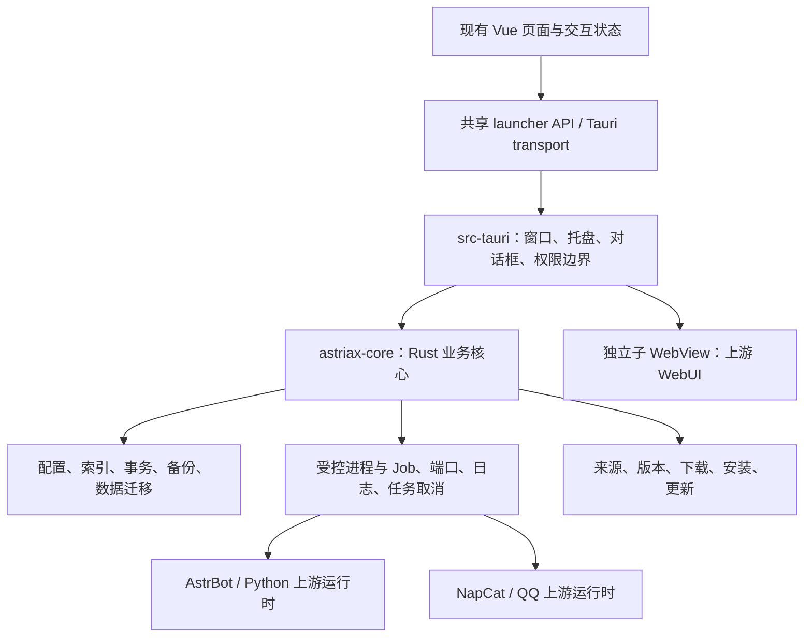

# Tauri + Vue 重构实施记录

日期：2026-10-10。对应 Electron 基线 `341683d`，当前应用版本 `1.0.2`。本次遵循用户明确选择的 Tauri + 现有 Vue 路线，替代原规划的全 Rust 原生 UI 推荐。

## 当前运行边界

默认开发、构建和打包入口已切换到 Tauri。发布包包含 Rust 桌面程序和编译后的 Vue 静态资源，使用系统 WebView2，不捆绑 Electron、Chromium 或启动器用 Node.js。前端构建与测试仍需要 Node.js/pnpm。

AstrBot、NapCat、QQ 都保持上游实现：AstrBot 由已验证的系统/手选 64 位 Python 3.12+ 或下载的内置 Python 3.12.10 启动；NapCat Shell 通过上游 `NapCatWinBootMain.exe`、Hook DLL 和 `napcat.mjs` 注入已安装 QQ；旧 Windows.Node 运行时保留 `node.exe + index.js` 启动适配。这些第三方运行环境没有改写为 Rust，第三方运行时自身的 Node/JS 组件也不属于启动器依赖。



`astriax-core` 不引用 Tauri，可通过独立 CLI 和集成测试运行。桌面框架依赖集中在 `src-tauri`；Vue 通过 transport 调用接口，页面不直接操作文件、执行进程或承担下载解压业务。

## 模块划分

| 目录 / 模块 | 职责 |
|---|---|
| `crates/astriax-core/src/domain.rs` / `error.rs` | 数据类型、兼容字段、路径片段、结构化错误 |
| `storage.rs` / `transaction.rs` | BOM JSON、原子写、数据根独占锁、多文件提交与启动恢复 |
| `tasks.rs` | 任务互斥、取消令牌、跨页面进度快照、事件分流 |
| `process.rs` / `platform*.rs` | 子进程树与 Windows Job、原生端口归属查询、QQ 注册表与版本识别 |
| `runtime/` | Python、版本目录、下载、导入、pip、上游元数据、Dashboard 和启动规格 |
| `instances/` | 创建、状态、启停、删除、版本绑定与实例更新；按操作拆分 |
| `backup/` / `settings/` | 流式备份与恢复、保留策略、复制校验及数据根迁移 |
| `logs.rs` / `napcat_logs.rs` / `credentials.rs` | 有界日志、GBK/UTF-8、审计、ZIP 导出、上游凭据读取与重置 |
| `sources.rs` / `distribution.rs` / `updater.rs` | 来源配置与测速、集中分发地址、fork 更新清单与全量安装包校验 |
| `maintenance/` / `astriax-maintenance` | 安装状态检查、升级 ZIP、数据根登记、旧文件清理、卸载数据维护 |
| `router/` | 旧请求通道适配，按实例、运行时和备份拆分 |
| `src-tauri/src/` | 桌面命令、窗口与托盘生命周期、WebUI、调试专用桌面验证 |
| `src/shared/launcher-api.ts` | transport 无关的前端 API，由 Tauri transport 接入 |
| `src/renderer/src/composables/` | 已接入页面的弹窗、日志、WebUI、版本、凭据、下载进度、来源、pip、导入和环境显示 |
| `src/renderer/src/styles/` | 中性色设计变量、Codex Windows 风格布局、各页面 scoped 样式 |

Rust 业务文件按职责拆分，没有把原来六千多行的 IPC 文件翻译成一个 Rust 大文件。Vue 的 App、下载页和设置页仍承担布局与页面编排；复杂操作状态已转入独立 composable，样式独立。旧 `.refactored` 文件、未接线的组件、旧 Pinia 状态层已删除。

## 已实现及验证状态

“已实现”表示存在实际调用路径；“测试通过”只覆盖下列具体验证，不能推定所有真实上游环境或原规划验收通过。

| 功能 | 当前实现 | 验证证据 / 尚需验证 |
|---|---|---|
| 桌面宿主 | 单实例、托盘、自定义标题栏、关闭策略、退出停止受控实例 | 实际 Vue ↔ Rust 桥接与正常退出通过；安装后 UAC、托盘、不同 DPI 待人工验收 |
| 内嵌 WebUI | 主窗口原生子 WebView、75% 缩放、同端口导航限制、切换销毁、快捷键退出 | 本地 HTTP 替身验证内嵌、权限隔离、Esc 关闭及关闭后的主窗口接口；真实 AstrBot/NapCat、IME、DPI、快速切换待验收 |
| 配置与实例 | 兼容 JSON、共享运行时、独立数据目录、端口分配、QQ/Python 前置检查 | BOM/未知字段、损坏文件不覆盖、共享运行时及创建/删除测试通过 |
| 进程与控制台 | 无可见控制台的受控启动、Job 子树、就绪等待、退出/取消清理 | Windows 实际父子进程、Job 监听归属、中文输出、取消回收、不结束无关监听者测试通过 |
| 上游安装与导入 | PATH Python 自动检测、手动选择、嵌入式下载兜底、pip target、Python ABI 检查、NapCat Shell、ZIP/WHL、Dashboard | 系统 Python 3.12.9 的实际隔离启动、中文与 .pth 依赖测试通过；版本/位数/pip 拒绝及选择保留测试通过；真实联网安装、QQ 注入未完整验证 |
| 实例版本与凭据 | 版本来自上游内容；切换事务、运行实例尝试重启、停止后更新、凭据重置 | 元数据和离线服务版本切换/自动重启/数据保留测试通过；真实上游重启与账密兼容待验收 |
| 日志与任务 | 后台持有任务、取消等待后台确认、GBK 解码、NapCat GET/Bearer 日志、日志裁剪、审计、ZIP 导出 | 本地 HTTP 日志替身与前端状态测试通过；当前没有原 Electron 崩溃转储收集器 |
| 备份恢复 | 流式私有格式、哈希与路径验证、旧包兼容、恢复前保护备份 | 冻结的旧 Node 生成包与边车哈希、中文往返、攻击路径及事务回滚测试通过 |
| 数据迁移 | 停止确认、空目标、逐文件哈希、提交后切根、失败不切根、保留旧根 | 隔离目录成功与失败测试通过；跨物理盘、空间不足待验收；已接入迁移后的数据根登记同步 |
| 启动器更新 | Soffd/AstriaX 的独立 Tauri 清单、24h 节流、跳过、多源重试、SHA-256、下载记录与退出安装 | 清单、来源、版本及被修改安装包拒绝测试通过；没有发布线上清单，线上更新路径待发布后验证 |
| 构建与安装包 | Tauri + Vite、MSVC、NSIS 与独立 Rust 维护程序 | 隔离标识及目录的实际安装、模拟版本升级、备份、保留/删除数据卸载、重装识别原根均通过；不覆盖所有历史 Electron / 机器级安装 |
| 页面布局 | 主侧栏、嵌入式设置导航与搜索、水平设置行、中性色组件 | 实际 Windows WebView2 截图检查与导航通过；嵌入式设置及 Python 环境交互测试通过 |

## 数据与兼容性

沿用 `config.json`、`instances.json`、`instance.json.runtimeTag`、`runtimes.json`、`mirrors.json`、`python-sources.json`、`data-root.txt` 和原数据布局，保留未知 JSON 字段。有效版本来自包内容，不用目录标签伪造。

新写入使用暂存、验证和事务提交：Python、同版本 pip、运行时替换、实例绑定和恢复失败时保持原有效状态；迁移只有全量复制与哈希通过才切根。取消发出后等 HTTP/外部进程清理完成，不能把“已发信号”显示为“已安全结束”。

历史实例 `.tar.gz` 实际为 gzip + 私有长度前缀记录，新实现兼容该格式以及旧侧车哈希。安装器升级备份为 ZIP，位于安装目录旁的 `AstriaX-update-backups`，仅供手动恢复，不送进实例恢复接口。运行时、日志、缓存和已有实例备份原位保留，不重复收入升级 ZIP。

数据根通过 `.astriax.lock` 防止两个 Rust 启动器同时写入。旧 Electron 不认识此锁：**使用已有数据前先退出旧启动器和实例，先保留原数据备份；不要让两种启动器同时读写同一根。** 调试默认使用独立 `.tauri-dev/data`。读取原根可通过 `ASTRIAX_DATA_ROOT`，或在安装目录的 `data-root.txt` 写入原根绝对路径；该路径需包含原 JSON 索引和共享运行时。设置中的“迁移”是复制到空目标，不是合并两套现有数据。

WebUI 是第三方页面，不能调用启动器配置/文件/进程接口；远程页面的关闭快捷键只请求销毁自身视图。显示 Vue 弹窗或切入资源页前关闭原生子视图，避免覆盖本地操作界面。当前使用 Tauri 的 `unstable` 子 WebView 功能，依赖版本由 Cargo.lock 固定，升级需重跑桌面验证。

## 构建与测试

Windows 10/11 x64，Rust MSVC、Visual Studio C++ Build Tools、Windows SDK、Node.js 20+、pnpm。脚本自动初始化现有 VS 环境，不安装系统组件。开发机可选 SDK 回落位于被忽略的 `tmp/windows-sdk`，不会进入发布包；普通开发者应安装完整 SDK。

```powershell
pnpm install
pnpm dev
pnpm check:web
pnpm test
pnpm check:clippy
pnpm build
pnpm dist
pnpm test:installer
```

`pnpm test` 运行当前 132 项 Vue/桥接回归测试与 29 项 Rust 集成测试。Vue 测试保留页面交互、下载缓存、定时器释放、弹窗、更新显示和样式检查；源码位置断言已随 composable 与样式拆分更新。依赖旧主进程的 Electron 测试及 `test:legacy` 入口已删除。

桌面验证使用隔离数据根、本地 HTTP 替身以及真实 Tauri/WebView2，脚本仅回收自己创建的测试进程：

```powershell
# 一个终端保持 Vite 运行
pnpm dev:web
# 另一个终端编译调试宿主并验证
powershell -ExecutionPolicy Bypass -File scripts/with-msvc.ps1 build -p astriax-desktop
pnpm test:desktop
```

Rust 测试覆盖存储/事务、备份格式、迁移失败、Windows Job 生命周期、NapCat HTTP 中文日志、上游版本读取、QQ 版本回落、Python 选择/ABI/真实解释器隔离启动、安装维护和更新清单/待安装包校验。桌面报告写入 `tmp/desktop-smoke-*/smoke.json`。

构建产物：`target/release/astriax-desktop.exe` 和 `target/release/bundle/nsis/AstriaX_1.0.2_x64-setup.exe`。安装包当前约 5.7 MiB，**不含系统 WebView2、Python、QQ、AstrBot/NapCat 运行时**。未完成内存、CPU、冷启动或与旧 Electron 同环境的性能基准，不以安装包体积证明这些性能指标。

## 更新清单与发布

Rust 更新器读取独立的 `tauri-latest.json`，拒绝 Electron 清单；下载必须提供 SHA-256。用户点击「退出并安装更新」时再次验证，然后停止受控实例并启动安装器；普通退出不安装。

```json
{
  "runtime": "tauri",
  "version": "1.0.2",
  "url": "https://github.com/Soffd/AstriaX/releases/download/v1.0.2/AstriaX_1.0.2_x64-setup.exe",
  "sha256": "64位十六进制SHA-256",
  "sizeMB": 5.7,
  "notes": "更新说明"
}
```

`astriax-release` 用 Rust 流式计算真实安装包哈希并生成清单，仅处理本地文件：

```powershell
powershell -ExecutionPolicy Bypass -File scripts/with-msvc.ps1 run -p astriax-core --bin astriax-release -- target/release/bundle/nsis/AstriaX_1.0.2_x64-setup.exe 1.0.2 target/release/bundle/nsis/tauri-latest.json
```

检测地址为 `https://github.com/Soffd/AstriaX/releases/latest/download/tauri-latest.json`。不会自动上传、发布或改远程仓库。安装器、卸载与发布步骤详见 [安装与更新](../install-and-update.md)。

## 旧实现清理

已删除旧 Electron 主进程与 preload、Electron 构建配置、NSIS 旧安装器资源、Node/Python 历史维护脚本、旧依赖快照、旧更新清单、重复组件和旧后端测试。构建脚本保留 Tauri、MSVC 环境初始化、桌面及隔离安装器验证。NSIS 模板沿用 Tauri 官方框架，仅调整升级前 hook 与内部卸载的更新标志，业务集中于 Rust 维护模块。TypeScript 配置统一为 `tsconfig.json`，不再配置旧主进程路径或单独的迁移配置。

当前 TypeScript 仅用于 Vue 页面、交互状态、Tauri 桥接和前端测试；Node.js/pnpm 是开发构建依赖。保留 Rust 测试使用的冻结旧备份样本，已删除其 Node 生成脚本；本地 Python HTTP 替身仅用于桌面冒烟测试。`README.md`、本文和源码对应当前实现，规划与 `inventory.json` 中的旧源码路径是 Git `341683d` 的历史分析快照；原实现可从 Git 历史查看。

## 发布前仍需完成

1. 在专用测试环境完成真实 Python/AstrBot/Dashboard 安装、启动、多实例和 QQ/NapCat 注入验证；包含联网错误与任务取消。
2. 验证 QQ 脱离受控 Job 的情况。目前无法证明归属的端口/QQ 进程不会被按 PID 强杀，停止未确认时阻止删除、恢复、迁移和退出；尚无基于进程创建时间与路径的脱链恢复机制。
3. 验证高 DPI、IME、焦点、WebUI 弹窗遮挡、快速开关、托盘与关闭策略。桌面替身测试不能替代真实页面验收。
4. 使用历史 Electron 安装包验收原位升级、旧登记清理、机器级安装和 UAC。当前已经实现覆盖更新备份、卸载保留/删除/取消及数据根同步；隔离 Tauri 安装器测试通过，旧文件清理有 Rust 测试，尚未覆盖所有历史安装身份和权限。
5. 补齐完整离线 WebView2 分发、安装器升级失败/回退、真实磁盘空间不足及跨盘恢复验收。当前只有在线 Bootstrapper 与全量安装包，没有差分更新。
6. 完成真实更新发布链路、故障场景和性能基准。历史维护脚本尚未逐个迁移为 Rust，不将原规划 M0–M6 全部标为完成。
